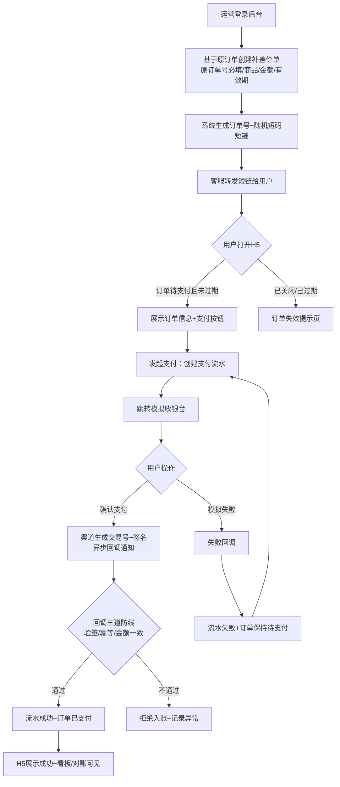

# 补差价系统 需求规格说明书（SRS）

| 文档信息 | 内容 |
|----------|------|
| 项目名称 | 补差价系统（Price Difference Payment System） |
| 版本 | v1.1 |
| 日期 | 2026-09-10 |
| 文档依据 | OpenSpec 变更 `add-price-diff-payment-system` 的 [proposal.md](../openspec/changes/add-price-diff-payment-system/proposal.md)、6 份 capability spec、[design.md](../openspec/changes/add-price-diff-payment-system/design.md) |
| 需求确认方式 | 结构化需求访谈（grill-me），全部关键分歧已与需求方对齐 |
| 变更记录 | v1.1（2026-09-10）：补差价单改为**基于原订单创建**——必填原订单号，选填原订单金额/原商品名称，支持按原订单号归集查询（§3.2 场景 A、§4.2、附录 B） |

---

## 1. 引言

### 1.1 编写目的

本文档在 proposal 与 specs 的基础上扩写，完整描述补差价系统的业务背景、用户角色、功能需求、非功能需求、验收标准与里程碑，作为开发、测试、演示与后续迭代的统一需求基线。行为细节以 `openspec/changes/add-price-diff-payment-system/specs/` 下的规格为最终权威，本文与其冲突时以 spec 为准。

### 1.2 项目范围

全新建设（greenfield），含后端服务（Java + Spring Boot）、前端应用（Vue3：后台管理端 / H5 支付页 / 模拟收银台）、数据库设计与核心资金链路自动化测试。支付渠道一期使用系统内 Mock（内置模拟收银台），但支付流程结构与真实渠道同构。

### 1.3 术语定义

| 术语 | 定义 |
|------|------|
| 补差价单（diff_order） | 基于某笔**原订单**（用户既有购买记录）因服务升级/变更需补足差价而生成的收款订单，必填原订单号，含商品名称、名额说明、金额、有效期 |
| 原订单 | 用户在既有业务系统（不在本项目范围）中购买服务所形成的订单；补差价单通过原订单号引用关联，系统不做存在性校验 |
| 支付流水（payment_txn） | 一次支付尝试的渠道级记录；一笔订单可有多条流水（失败重试），是对账最小颗粒度 |
| 短链 | 订单专属的分发链接，由 8 位随机短码构成，匿名用户凭其访问 H5 支付页 |
| 模拟收银台 | 系统内模拟微信/支付宝风格的第三方收银台页面，提供"确认支付/模拟支付失败"操作 |
| 异步回调 | 渠道服务器将支付结果以 HTTP 通知方式回传商户系统的机制，本系统内由模拟渠道回环发起 |
| 幂等 | 同一笔回调重复投递时，系统仅入账一次且应答一致的特性 |
| 惰性校验 | 不依赖定时任务执行时点、在关键动作（如入账）发生时再做一次时效校验的防御机制 |

### 1.4 参考资料

- OpenSpec 变更文档：`openspec/changes/add-price-diff-payment-system/`（proposal / specs×6 / design / tasks）
- 项目记忆：2026-09-10 需求访谈决策记录（`project_memory.md`）

---

## 2. 业务背景与目标

### 2.1 现状与痛点

公司为 to-C 业务模式，用户购买服务后常因升级、变更服务内容需要补一笔差价。当前由客服手动引导用户私下转账：

| # | 痛点 | 业务影响 |
|---|------|----------|
| 1 | 收款无凭证 | 转账截图易伪造、易遗漏，纠纷无法举证 |
| 2 | 金额无校验 | 转多转少全靠人工核对，错误成本高 |
| 3 | 进度无跟踪 | 客服人工跟催，用户体验差、效率低 |
| 4 | 财务无法对账 | 私人收款与业务订单无法关联，存在资损与合规风险 |

### 2.2 项目目标

建设规范化补差价收款系统：**运营建单 → 生成 H5 支付页与短链 → 客服转发 → 用户在线支付 → 全流程可视化对账**。

### 2.3 项目定位与成功标准

定位（已与需求方对齐）：**可演示完整链路，核心资金链路（幂等/状态机/对账）按生产标准设计，外围功能简化**。

成功标准：

1. **可运行**：两条命令（后端 `mvn spring-boot:run` + 前端 `npm run dev`）启动全系统，零外部依赖（默认 H2）
2. **可演示**：完整走通"建单 → 短链 → H5 支付（含失败重试）→ 回调入账 → 看板可见"全链路
3. **可讲解**：关键设计决策（幂等三道防线、关单双保险、支付网关抽象、短码设计）有文档与测试支撑

---

## 3. 用户角色与使用场景

### 3.1 角色定义

| 角色 | 系统载体 | 主要职责 | 鉴权方式 |
|------|----------|----------|----------|
| 运营 | 后台管理端 | 创建补差价单、跟踪支付情况、手动关单、查看看板 | 账号密码 + JWT |
| 客服 | 系统外（IM 工具） | 将运营生成的支付短链转发给用户 | 无需系统账号 |
| C 端用户 | H5 支付页 | 查看补差价订单、完成支付、查看结果 | 短链匿名（短码即凭证） |
| 财务/管理者 | 后台看板 | 掌握收款总额、订单状态分布、成功率与趋势 | 账号密码 + JWT |

> 说明：本期不区分运营/管理员的细粒度 RBAC，所有后台登录账号均可执行建单与看板操作；每笔业务数据记录操作人（created_by）以满足追溯需求（Non-goal 之一，见 §8）。

### 3.2 关键用户场景

**场景 A：服务升级补差价（主链路）**
运营接到用户升级诉求 → 在后台找到该用户的**原订单**（如订单号 SO20260901001，"Python 基础班" ¥2000）→ 基于该原订单创建补差价单（原订单号必填、商品"升级至 Python 进阶班"、金额 ¥800、名额说明、有效期 48h）→ 系统返回订单号与短链 → 客服将短链发给用户 → 用户手机打开 H5 确认订单信息 → 点击支付进入收银台 → 确认支付 → 支付成功 → 后台列表与看板实时可见；财务按原订单号归集可得"¥2000 + ¥800 = 累计实付 ¥2800"。

**场景 B：支付失败重试**
用户在收银台选择模拟支付失败 → 流水置为失败、订单保持待支付 → H5 展示失败页并提供"重新支付" → 用户重试生成**新**支付流水 → 支付成功。原失败流水保留可追溯。

**场景 C：订单超时关闭**
用户一直未支付，超过 48h 有效期 → 定时任务将订单置为已关闭 → 用户再打开短链提示已失效；若恰在过期瞬间渠道回调到达，惰性校验拒绝入账（资金安全双保险）。

**场景 D：运营主动撤单**
用户放弃升级 → 运营手动关闭待支付订单 → 短链同步失效。

**场景 E：财务对账**
财务按日查看看板：累计收款、今日收款、各状态订单数、支付成功率、近 7 日趋势；对单个可疑订单查看详情，核对多条支付流水的渠道交易号与金额。

### 3.3 核心业务流程

---

## 4. 功能需求

> 编号规则：FR-<模块字母><序号>。各 FR 的可测验收场景详见对应 spec（共 6 个能力、24 个 Requirement、45 个 Scenario），此处汇总功能点与关键规则。

### 4.1 后台登录鉴权（admin-auth）

| 编号 | 功能点 | 关键规则 |
|------|--------|----------|
| FR-A1 | 账号密码登录 | 凭据正确签发访问令牌；错误返回统一提示，不泄露账号是否存在 |
| FR-A2 | 管理接口鉴权 | `/api/admin/**` 强制鉴权；无令牌/无效/过期一律拒绝且不执行业务 |
| FR-A3 | 操作归属记录 | 建单等关键数据记录操作账号，可追溯操作人 |

### 4.2 补差价单管理（diff-order-management）

| 编号 | 功能点 | 关键规则 |
|------|--------|----------|
| FR-O1 | 基于原订单创建补差价单 | 必填：**原订单号**、商品/服务名称、补差金额；选填：原订单金额、原商品名称、名额说明、备注；有效期默认 48h 可调；同一原订单号允许创建多笔补差价单（多次升级）；原订单号不做存在性校验（原订单系统不在本项目范围）；创建成功返回唯一订单号 + 支付短链 |
| FR-O2 | 订单列表与详情 | 分页 + 状态/关键词/**原订单号**/时间筛选；详情含全部字段、原订单信息与全部支付流水，支持按原订单号归集查看多次补差记录 |
| FR-O3 | 订单状态机 | 待支付/已支付/已关闭三态；仅待支付可流转；非法流转一律拒绝且数据不变 |
| FR-O4 | 超时自动关单 | 定时扫描 + 回调惰性校验双保险；超时订单的迟到成功回调必须拒绝入账 |
| FR-O5 | 手动关单 | 仅待支付可关；关闭后短链失效；已支付订单不可关 |

字段级说明：

| 字段 | 必填 | 说明 |
|------|------|------|
| 原订单号 | 是 | 业务关联键（如 SO20260901001）；一笔原订单可对应多笔补差价单（多次升级）；系统不做存在性校验，真实性由运营录入时保证（未来可对接原订单系统 API 校验） |
| 商品/服务名称 | 是 | 如"Python 进阶班升级" |
| 补差金额 | 是 | 单位：分（Long 存储），必须 > 0 |
| 原订单金额 | 否 | 选填，供详情/对账展示"原订单 + 补差价 = 累计实付" |
| 原商品名称 | 否 | 选填，冗余展示用，避免仅凭单号无法辨识 |
| 名额/说明 | 否 | 描述性信息（如"第 3 期 · 剩余名额 20"），**非库存**，不参与任何扣减逻辑 |
| 备注 | 否 | 运营内部备注 |
| 有效期 | 否 | 默认 48h，可调整 |

### 4.3 短链（short-link-access）

| 编号 | 功能点 | 关键规则 |
|------|--------|----------|
| FR-L1 | 短链生成 | 每单一码；密码学安全随机 8 位字母数字（Base62），不可猜测、不可遍历；唯一索引兜底 |
| FR-L2 | 短链换取订单信息 | 返回商品、名额说明、金额、状态、剩余有效期；金额一律以服务端存储值为准 |
| FR-L3 | 短链有效期跟随订单 | 仅待支付且未过期可用；已关闭/过期订单提示失效，无支付入口 |

### 4.4 H5 支付（h5-payment）

| 编号 | 功能点 | 关键规则 |
|------|--------|----------|
| FR-H1 | 查看待支付订单 | 展示订单信息与支付按钮；失效订单展示失效态页 |
| FR-H2 | 发起支付 | 生成**新**支付流水并返回收银台跳转地址；仅待支付订单可发起 |
| FR-H3 | 支付结果与重试 | 成功/失败结果页；失败提供"重新支付"，重试产生新流水而非复用 |
| FR-H4 | 金额服务端权威 | 发起支付仅提交订单标识；客户端任何金额参数被忽略或拒绝 |

### 4.5 模拟支付渠道与回调（mock-payment-channel）

| 编号 | 功能点 | 关键规则 |
|------|--------|----------|
| FR-P1 | 统一支付网关抽象 | 预下单/验签收敛于统一接口；渠道以实现类插拔，替换不动业务流程 |
| FR-P2 | 模拟收银台 | 第三方风格页面：流水号 + 应付金额 + "确认支付/模拟支付失败"两个操作 |
| FR-P3 | 回调验签 | HMAC-SHA256 签名校验；验签失败拒绝且不触碰任何数据 |
| FR-P4 | 回调幂等 | 渠道交易号唯一约束兜底；重复回调返回受理成功但仅入账一次 |
| FR-P5 | 回调状态回写 | 成功：流水成功 + 订单已支付；失败：仅流水失败、订单保持待支付可重试 |
| FR-P6 | 回调金额一致性 | 回调金额 ≠ 流水应付金额时拒绝入账并记录异常 |

### 4.6 数据看板（payment-dashboard）

| 编号 | 功能点 | 关键规则 |
|------|--------|----------|
| FR-D1 | 订单支付情况列表 | 全量订单 + 支付状态/金额/支付时间/流水；状态筛选、搜索、时间过滤、分页 |
| FR-D2 | 汇总指标 | 累计收款、今日收款、订单总数、各状态计数、支付成功率；空数据展示零值不报错 |
| FR-D3 | 收款趋势 | 近 N 日（默认 7 天）每日收款金额与成交订单数，无数据日补零 |

---

## 5. 非功能需求

| 编号 | 类别 | 需求 |
|------|------|------|
| NFR-S1 | 安全性 | 回调必须验签（HMAC-SHA256 + 渠道密钥），伪造回调零影响 |
| NFR-S2 | 安全性 | 后台口令 BCrypt 存储；JWT (HS256) 签发与校验，过期自动失效 |
| NFR-S3 | 安全性 | 短码由 SecureRandom 生成（62⁸ ≈ 2.18×10¹⁴ 组合空间），枚举命中概率可忽略 |
| NFR-S4 | 安全性 | 支付金额以服务端为唯一权威，客户端金额参数无效（防篡改） |
| NFR-S5 | 安全性 | H5 下发信息最小化：不含用户手机号等敏感 PII（短链匿名转发场景） |
| NFR-S6 | 安全性 | 金额不一致等资金异常必须落库记录，供排查与对账 |
| NFR-R1 | 可靠性 | 回调幂等：重复投递仅入账一次，且应答一致（避免渠道重发风暴） |
| NFR-R2 | 可靠性 | 状态机 + 数据库条件更新兜底：轮询/回调并发到达时仅一次生效 |
| NFR-R3 | 可靠性 | 关单双保险：定时扫描与惰性校验互为冗余，资金安全不依赖任务准时性 |
| NFR-P1 | 性能 | 演示规模（订单 ≤ 1 万、并发 ≤ 50）下接口 P95 < 500ms |
| NFR-P2 | 性能 | 回调处理端到端（收到通知到状态落库）< 2s |
| NFR-P3 | 性能 | H5 结果轮询间隔 2s、上限 30s 后停止 |
| NFR-O1 | 可运维 | 默认配置零外部依赖（H2 文件库），`mvn spring-boot:run` + `npm run dev` 两条命令启动 |
| NFR-O2 | 可运维 | 提供 PostgreSQL profile + docker-compose，一条命令切换生产级数据库 |
| NFR-O3 | 可运维 | 关键动作（建单、预下单、回调、关单、拒绝入账）输出结构化日志 |
| NFR-O4 | 可运维 | 定时关单扫描周期 1 分钟，可配置 |
| NFR-C1 | 兼容性 | H5 支持移动端现代浏览器（iOS Safari、Android Chrome、微信内置浏览器） |
| NFR-C2 | 兼容性 | 后台支持桌面端 Chrome/Edge 最新两个大版本 |
| NFR-T1 | 可测试 | 四类资金安全点必须有自动化测试：回调幂等、非法状态流转、超时关单、短码/金额安全 |
| NFR-T2 | 可测试 | 测试使用 H2 内存库，`mvn test` 一键执行，不依赖外部环境 |
| NFR-E1 | 可扩展 | 支付渠道插拔：新增真实微信/支付宝仅需新增 Gateway 实现与配置，不动订单业务流程 |
| NFR-E2 | 可扩展 | 数据模型预留 `refund_status`（退款）与 `fulfill_status`（履约）字段 |
| NFR-E3 | 可扩展 | 多实例演进路径明确：现有唯一约束 + 条件更新之上补充分布式锁或 MQ 串行化即可 |
| NFR-D1 | 数据 | 金额一律 BIGINT 分存储，禁止浮点 |
| NFR-D2 | 数据 | 关键业务数据记录操作人与时间戳（created_by/created_at/paid_at/closed_at） |

---

## 6. 验收标准汇总

> 完整可测场景见各 spec（45 个 Scenario）；下表为按模块汇总的验收清单，全部通过即视为功能验收通过。

| 模块 | 验收标准（摘要） | Spec 场景覆盖 |
|------|------------------|---------------|
| 后台登录鉴权 | 正确凭据可登录获 token；错误密码统一提示；无/无效/过期 token 访问管理接口被拒；建单记录操作人 | 6 |
| 补差价单管理 | 建单成功（含原订单号关联）返回订单号+短链；缺原订单号、金额≤0、缺必填被拒；同一原订单可多笔建单；按原订单号归集查询正确；详情含原订单信息与多条流水；非法状态流转被拒；超时订单被扫描关闭且迟到回调拒绝入账；手动关单规则正确 | 14 |
| 短链 | 建单返回短链；短码不可枚举；待支付订单信息完整下发；已关闭订单提示失效且不可支付 | 5 |
| H5 支付 | 待支付页信息与按钮正确；失效页无支付入口；发起支付生成新流水；关闭订单发起被拒；成功/失败结果页正确；失败重试生成新流水；篡改金额无效 | 7 |
| 模拟渠道与回调 | 预下单返回收银台地址；收银台两操作触发对应回调；伪造签名拒绝；重复回调仅入账一次且应答 SUCCESS；成功回写订单/失败订单可重试；金额不一致拒绝入账 | 9 |
| 数据看板 | 列表分页筛选正确；汇总指标与库内数据一致；空库零值不报错；近 7 日趋势按日聚合、缺日补零 | 4 |

端到端验收（对应 tasks.md 任务组 7）：

1. 后端全量测试通过（`mvn test` 全绿）
2. 全链路人工走查：建单 → 复制短链 → H5 打开 → 支付失败 → 重新支付 → 成功 → 看板数据更新
3. 超时关单演示（演示订单有效期调短）
4. PostgreSQL profile 实测通过
5. README 可支撑第三方从零启动并复现演示

---

## 7. 里程碑

| 里程碑 | 名称 | 主要内容 | 出口准则 | 对应任务组 |
|--------|------|----------|----------|------------|
| M1 | 基础设施就绪 | 前后端工程骨架、统一响应体/异常体系、三表 DDL、H2 默认 + PG profile、种子账号 | 两条命令可启动，建库成功 | 任务组 1 |
| M2 | 后台与订单域可用 | 登录鉴权、基于原订单建单/列表/详情（含原订单号归集）、状态机、手动关单、定时关单 + 惰性校验 | 订单域单测全绿，后台可建单管理 | 任务组 2、3 |
| M3 | 支付闭环贯通 | 短链生成与跳转、H5 支付页、模拟收银台、网关抽象、回调三道防线 | 幂等/状态机/关单/金额安全测试全绿，H5 全流程可走通 | 任务组 4、5 |
| M4 | 数据看板 | 汇总指标、趋势接口、后台管理界面与图表 | 看板数据与订单事实一致 | 任务组 6 |
| M5 | 端到端验收交付 | 全量测试、全链路走查、PG 实测、README 与演示脚本 | §6 端到端验收五项全部通过 | 任务组 7 |

里程碑按依赖串行推进；M3 为资金链路核心，其自动化测试为最重出口准则。

---

## 8. 范围外（Non-goals）

以下内容**本期明确不做**（数据模型已预留扩展点，留待后续变更）：

1. 退款（含部分退款、原路退回）
2. 支付成功后的履约触发（下游权益/服务变更通知）
3. 真实支付渠道对接（证书管理、对账文件下载、渠道对账单核对）
4. 多实例高可用部署、分布式锁、消息队列
5. 细粒度 RBAC 权限体系与多租户
6. 短链自定义别名、访问统计等运营增强功能

---

## 附录 A：能力规格索引

| 能力 | Spec 路径 |
|------|-----------|
| 后台登录鉴权 | `openspec/changes/add-price-diff-payment-system/specs/admin-auth/spec.md` |
| 补差价单管理 | `.../specs/diff-order-management/spec.md` |
| 短链生成与访问 | `.../specs/short-link-access/spec.md` |
| H5 支付交互 | `.../specs/h5-payment/spec.md` |
| 模拟支付渠道与回调 | `.../specs/mock-payment-channel/spec.md` |
| 数据看板 | `.../specs/payment-dashboard/spec.md` |

## 附录 B：关键技术决策速查（详见 design.md）

| 决策 | 结论 |
|------|------|
| D1 架构 | 前后端分离单体：Spring Boot 3 + Vue3/Vite |
| D2 支付链路 | 与真实渠道同构：预下单 → 收银台 → HTTP 回环异步回调 → 查单兜底 |
| D3 回调幂等 | 三道防线：验签 → 渠道交易号唯一约束 → 状态机前置校验 |
| D4 数据模型 | 订单/流水分表；补差价单必填原订单号引用关联（1:N，不做存在性校验）；金额 BIGINT 分；预留退款/履约字段 |
| D5 状态机 | 领域服务显式校验 + 条件 UPDATE 兜底 |
| D6 订单有效期 | 48h 默认；定时扫描 + 回调惰性校验双保险 |
| D7 短链 | SecureRandom 8 位 Base62；金额服务端下发 |
| D8 鉴权 | 后台 JWT + BCrypt；H5 短码即凭证 |
| D9 数据库 | H2 默认 + PostgreSQL profile；MyBatis-Plus |
| D10 API 契约 | 统一响应体 `{code,message,data}` + 明确错误码 |
| D11 测试 | 资金安全四类自动化测试 |
