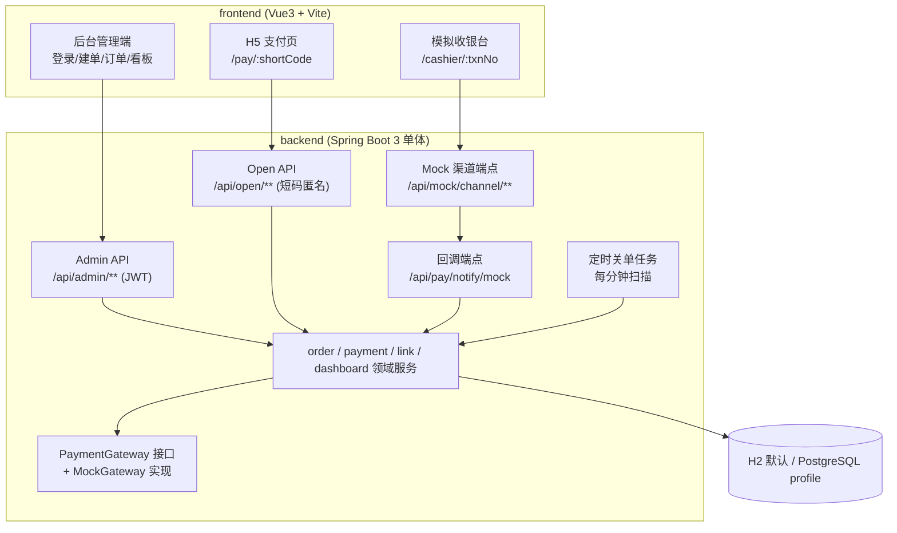
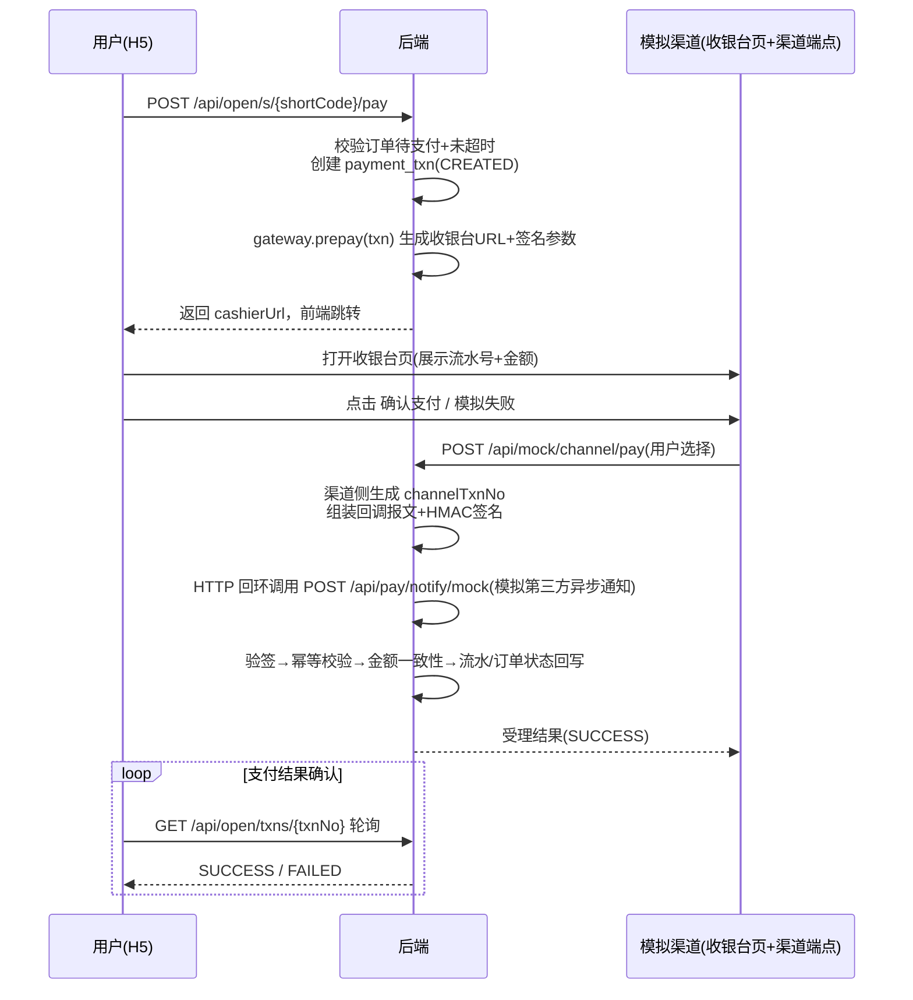
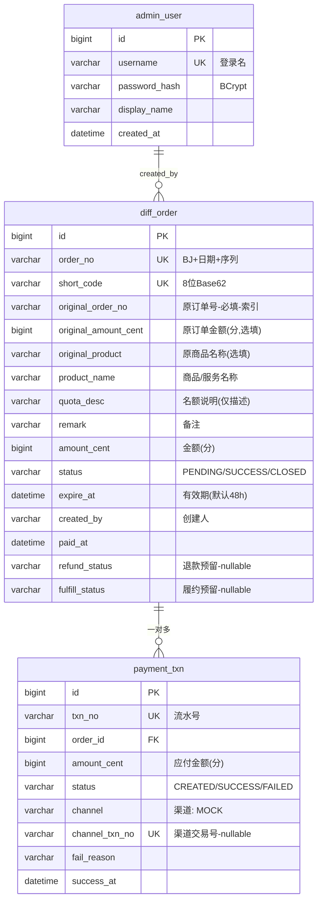

# Design: 补差价系统技术设计

## Context

全新项目（greenfield），无遗留系统约束。动机与业务范围见 [proposal.md](./proposal.md)，行为契约见各 capability spec。本设计已在需求访谈中与需求方对齐技术路线（2026-09-10），此处记录选型理由与落地方案。

核心约束：
- 单人可一键运行演示（零外部依赖默认配置）
- 资金链路（幂等、状态机、金额一致性）按生产标准，外围简化
- 支付渠道为 Mock，但回调结构必须与真实渠道（微信/支付宝）同构，未来可插拔替换

## Goals / Non-Goals

**Goals:**
- 完整演示链路：运营建单 → 生成短链 → 用户 H5 支付 → 异步回调入账 → 后台看板可见
- 支付流程结构与真实渠道一致：预下单、收银台、异步回调、验签、幂等、对账颗粒度
- 核心资金安全行为有自动化测试覆盖
- 单 jar 后端 + 单前端工程，两条命令启动全系统

**Non-Goals:**
- 真实支付渠道对接（证书、对账文件下载）——仅保留扩展点
- 退款、支付成功后的履约/权益变更触发——数据模型预留字段，流程不实现
- 多实例高可用部署、分布式锁、消息队列——单实例假设
- 细粒度 RBAC 权限体系——登录即运营，操作人字段满足追溯即可

## Decisions

### D1: 整体架构 —— 前后端分离的单体

后端 Spring Boot 3 单体提供全部 REST API；前端 Vue3/Vite 独立工程承载三个页面（后台管理端、H5 支付页、模拟收银台）。

理由：当前规模下微服务/多模块是过度设计；前后端分离满足"生产感"与 API 设计可讲解性；模拟收银台放在前端工程中作为独立路由页，用第三方视觉风格呈现"跳出系统再回来"的体验。

**备选**：Thymeleaf 服务端渲染（无法展示 RESTful 契约，弃）；前后端各自多模块（规模不匹配，弃）。

### D2: 支付核心链路 —— 与真实渠道同构的回调闭环

支付时序（关键路径）：

设计要点：
- **回环 HTTP 回调**：模拟渠道收到用户支付操作后，由后端以 HTTP 回环（RestClient 调用自身 `/api/pay/notify/mock`）发起异步通知，而非进程内方法调用。保证回调路径（签名、报文、幂等、返回应答）与真实渠道完全同构，测试与讲解价值最大。
- **主动查询兜底**：H5 轮询流水状态（前端 2s 间隔、上限 30s），模拟真实 H5 支付"服务端回调 + 客户端查单"双通道。
- **备选**：进程内直调回调逻辑（实现最简，但验签/报文/应答环节全部失真，弃）。

### D3: 回调幂等 —— 三道防线

1. **验签**：回调报文携带 HMAC-SHA256 签名（渠道密钥），验签失败直接拒绝，不触碰任何数据。
2. **唯一约束**：`payment_txn.channel_txn_no` 唯一索引。重复回调（相同渠道交易号）写入时被数据库拒绝，业务层捕获后按"已受理"返回 SUCCESS（真实渠道要求重复通知也返回成功以停止重发）。
3. **状态机前置校验**：仅 `CREATED/PAYING` 流水可被更新为终态；已终态流水的回调走幂等应答路径，不做二次状态变更。

**备选**：叠加 Redis/分布式锁（单实例下属于过度设计，弃；多实例化时在防线 2、3 基础上补充即可）。

### D4: 订单与流水分离的两层数据模型

理由：一笔订单允许多次支付尝试（失败重试生成新流水），订单状态由"任一流水成功"驱动；流水表是对账的最小颗粒度，记录每次渠道交互。金额统一用 `BIGINT` 分存储，规避浮点误差。`refund_status`/`fulfill_status` 为 non-goal 预留列，不参与本期逻辑。

原订单关联（引用式）：补差价单是原订单的从属交易，没有原订单锚点就无法对账（不知道补的是哪个订单的差额）。`original_order_no` 为必填业务关联键（普通索引，同一原订单 1:N 多笔补差价单，对应多次升级场景）；`original_amount_cent`/`original_product` 为选填冗余展示字段，支撑"原订单 + 补差价单 = 累计实付"的对账视角。原订单系统不在本项目范围内，系统不做存在性校验，真实性由运营录入时保证；未来可对接原订单系统 API 增加实时校验（扩展点，本期不做）。

订单号 `BJ + yyyyMMdd + 6位序列`（人类可读可对账）；流水号 `TX + 同规则`。序列用数据库自增 + 应用层格式化，单实例无并发问题。

### D5: 状态机 —— 显式校验 + 数据库条件更新兜底

- `diff_order`: `PENDING → SUCCESS`（支付成功）、`PENDING → CLOSED`（超时/手动），`SUCCESS/CLOSED` 为终态。
- `payment_txn`: `CREATED → SUCCESS / FAILED`，`SUCCESS/FAILED` 为终态。

流转统一收敛在订单领域服务中：先业务校验（拒绝非法流转，抛业务异常），再以带状态条件的 UPDATE 落库（`UPDATE diff_order SET status='SUCCESS' WHERE id=? AND status='PENDING'`，影响行数为 0 即并发竞争失败，走幂等处理）。轮询查单与回调可能并发到达，条件更新保证只有一次生效。

### D6: 订单有效期 —— 定时扫描 + 回调惰性校验双保险

- 建单默认有效期 48h（可调）。`@Scheduled` 每分钟扫描 `status=PENDING AND expire_at < now()`，批量置为 `CLOSED`。
- 支付回调入账前再校验一次 `expire_at`：超时订单即使未被扫描（演示时可将扫描间隔调大），也拒绝入账并将订单置为 `CLOSED`，同时记录异常日志。

理由：定时任务保证列表观感与短链及时失效；惰性校验保证资金安全不依赖任务执行的准时性——与真实生产"关单与入账竞态"的防御思路一致。

### D7: 短链 —— 密码学随机短码 + 服务端权威下发

- 短码：`SecureRandom` 生成 8 位 Base62（62^8 ≈ 2.18×10^14 空间），碰撞概率可忽略；`short_code` 唯一索引兜底，冲突时重试生成。
- 访问契约：`GET /s/{shortCode}` 302 跳转前端 H5 路由；H5 再凭短码调开放 API 换取订单信息。短码即匿名凭证，不存在遍历风险。
- 金额、状态等关键信息一律服务端下发；发起支付仅提交短码/流水号，客户端任何金额参数被忽略——防篡改不依赖前端。

**备选**：自增 ID 转 Base62（可被枚举遍历，资金场景不可接受，弃）；短链加 HMAC 签名参数（随机短码已不可猜，URL 冗长收益低，弃）。

### D8: 鉴权 —— JWT 无状态 + BCrypt 口令

- 后台：账号密码登录（BCrypt 校验），签发 HS256 JWT（含账号、过期时间），管理接口经过滤器统一鉴权，401 语义明确。演示环境启动时种子账号 `admin / admin123`。
- H5：不引入登录体系，短码即凭证（见 D7）。

**备选**：Session + Redis（无状态 JWT 单体更简，演示环境无需会话管理，弃）。

### D9: 数据库与 ORM —— H2 默认 + PostgreSQL profile；MyBatis-Plus

- DDL 使用可移植标准 SQL（BIGINT/VARCHAR/TIMESTAMP），H2 与 PG 共用同一 schema 脚本，避免方言分支；`docker-compose.yml` 提供 PG 一键启动，`spring.profiles.active=pg` 切换。
- MyBatis-Plus：SQL 可控（对账/统计查询多），国内主流、讲解与协作友好；分页插件与自动填充（created_at 等）直接可用。

### D10: API 契约 —— 统一响应体 + 资源化路由

- 统一响应体 `{"code": 0, "message": "ok", "data": {...}}`；业务错误用明确错误码（如 `ORDER_CLOSED`、`SIGN_INVALID`、`AMOUNT_MISMATCH`），HTTP 状态码保留给鉴权与系统级错误。
- 路由分组：`/api/admin/**`（JWT）、`/api/open/**`（短码匿名）、`/api/pay/notify/mock`（渠道回调）、`/api/mock/channel/**`（模拟渠道操作）。

### D11: 测试策略 —— 资金安全点优先

JUnit 5 + Spring Boot Test（测试用 H2 内存库），覆盖四个资金安全点，对齐 spec 场景：

1. 回调幂等：同一成功回调投递两次，仅一次入账，第二次返回受理成功
2. 状态机：非法流转（已支付再支付、已关闭入账）被拒绝且数据不变
3. 超时关单：超时订单被扫描关闭；超时订单的迟到成功回调被拒绝入账
4. 短码与金额：短码不可枚举（格式与唯一性）、篡改金额参数无效、验签失败拒绝

前端不做自动化测试，靠演示验证（外围简化定位）。

## Risks / Trade-offs

- [单实例假设，回调幂等依赖 DB 约束 + 条件更新] → 若未来多实例部署，在防线之上补充分布式锁或渠道回调经 MQ 串行化；当前规模无必要，设计已预留演进路径
- [HTTP 回环回调要求应用可自呼自身端口] → 演示环境无碍；提供配置开关可降级为进程内回调（保留相同报文与签名逻辑），并保证生产化时替换为真实渠道 URL 即可
- [H2 与 PostgreSQL 方言差异] → DDL 刻意使用可移植类型、不使用存储过程/方言函数；PG profile 在交付前实测一轮
- [轮询查单与回调并发竞态] → 条件 UPDATE + 唯一约束兜底（D5/D3），最坏情况是一次多余的"幂等应答"
- [短码泄漏即订单可被查看（匿名语义）] → 产品已确认匿名转发是预期用法；订单信息不包含用户手机号等敏感 PII，泄露面可控
- [模拟收银台与真实渠道体验差异] → 演示定位明确接受；真实渠道接入仅涉及新增 Gateway 实现 + 渠道配置，不动业务流程（D2 契约同构的意义）

## Migration Plan

全新项目，无存量数据迁移：

1. 后端 `backend/`：`mvn spring-boot:run`（默认 H2 文件库，首次启动自动建表 + 种子管理员账号）
2. 前端 `frontend/`：`npm install && npm run dev`（Vite 代理指向后端）
3. 可选生产化验证：`docker compose up -d` 启动 PostgreSQL → 后端以 `pg` profile 启动
4. 回滚策略：不适用（无升级场景）；数据备份按常规数据库备份执行

## Open Questions

（无 —— 需求访谈已消解全部实质性分歧；真实渠道对接细节属于后续变更范畴，不影响本期规格与任务拆解。）
